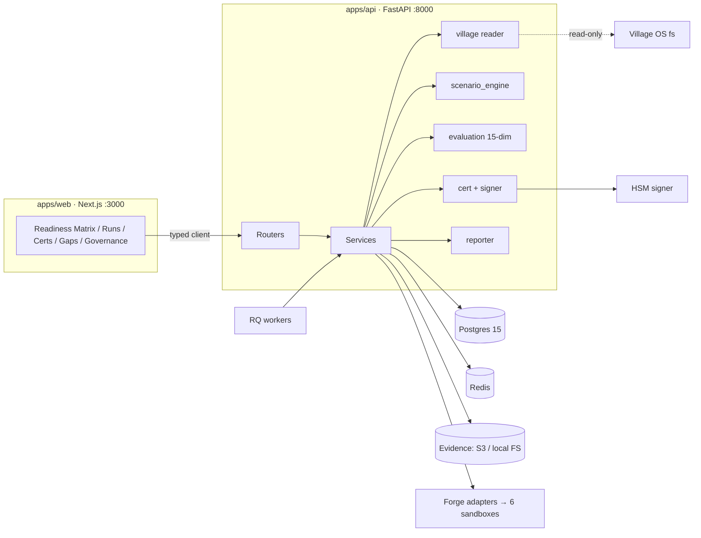

# SimForge — Architecture Overview

> This is the orientation doc. The exhaustive engineering detail lives in [`BLUEPRINT.md`](BLUEPRINT.md); philosophy in the canonical spec ([`SPEC.md`](SPEC.md)). Build sequencing is in [`ROADMAP.md`](ROADMAP.md).

## What SimForge does

SimForge is the **governance and certification layer** for a "Village" of AI agents. It:

1. **Reads** an agent's cognitive state from Village OS (read-only) into a **CCB** (Cognitive Context Bundle).
2. **Runs** the agent through a **scenario** (simulated high-stakes situation) against a **mock world** (personas + Forge sandbox stubs).
3. **Scores** the run on a **15-dimension rubric** (8 performance P1–P8, 7 cognitive C1–C7).
4. **Gates** the score against per-Pack **Readiness thresholds** (hard auto-fails on compliance violation or ARC fragmentation).
5. On pass, **issues a signed CertSnapshot** pinning every version involved, and moves the agent up the **Autonomy Ladder** (L1–L5).
6. **Reports** three ways: agent scorecard, Software Gaps (per Forge), Village-OS Gaps (per framework) — routed to Linear.

The result: an agent's production autonomy is gated by cryptographically-verifiable, version-pinned evidence of competence.

## System shape

## Layers

| Layer | Where | Notes |
|---|---|---|
| **Data** | `packages/db/schema.prisma` | 17 entities; single source of truth for TS + Python. See blueprint §B. |
| **Backend** | `apps/api/src` | routers → services → workers. Async FastAPI. See §C. |
| **Village coupling** | `services/village` | read-only fs reader + CCB composer + fingerprint. |
| **Scenario engine** | `services/scenario_engine` | state machine: setup→cold_open→turn→complication→resolution→wrap. |
| **Agent runtime** | `services/agent_runtime` | replicates Village 9-layer prompt assembly; Ollama/OpenAI. |
| **Mock world** | `services/mock_world` | personas + Forge proxies/stubs. |
| **Evaluation** | `services/evaluation` | 15 parallel dimension scorers + readiness gate + regression. |
| **Cert** | `services/cert` | registry + snapshot + HSM signer + autonomy ladder + revocation. |
| **Governance** | `services/governance` | constitution + amendments + approvals + safe-mode. |
| **Frontend** | `apps/web/src` | App Router + RSC; Zustand + TanStack Query; shadcn/ui; gold-on-ink design tokens. |

## Key invariants (do not violate)

- **Sandbox isolation:** sandbox runs never write to Village (no episode, no FOT tick, no DB write).
- **Version pinning:** every CertSnapshot pins pack/scenario/policy/rubric/constitution/prompt/model/forge/village versions.
- **Gate auto-fails:** compliance violation or ARC fragmentation → immediate fail regardless of other scores.
- **Fingerprint drift → block issuance:** Village schema drift halts new certs until reviewed.
- **No real PHI/PII** anywhere; synthetic fixtures only; validator rejects real SSN/DOB.
- **Ivan-only, audited:** cert issue/revoke, autonomy promote/demote, constitution ratify/veto, Pack ratification.

## Local dev

See [`../README.md`](../README.md) quick start and [`DECISIONS.md`](DECISIONS.md) ADR-0001 (everything external is stubbed locally).
